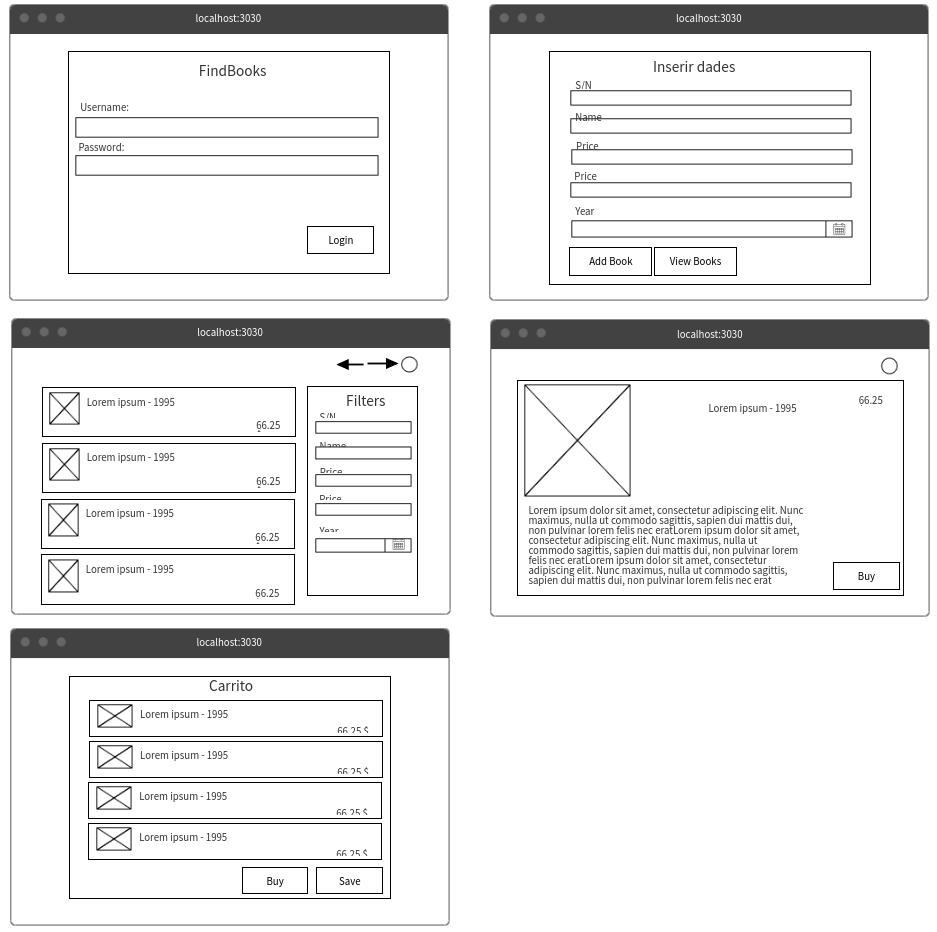

# Documentación

## Entrega 0

### Integrantes:

- Barbara Herrera Flores
- Christian Miranda Balladares
- Pol Barcia Torres

### Descripción.

Realizar una tienda de libros con su base de datos, donde el cliente puede comprar los libros directamente desde la web.Consistirá en una página donde el usuario se puede registrar, buscar libros que quiera mediante filtros, pueda valorarlos e incluso comprarlos (o por lo menos tener un enlace a algún sitio de compra).

### Arquitectura de la aplicación.

El usuario accederá a la aplicación a través del frontend web, que estará implementado en Vue. El frontend se comunicará con el backend, que será una aplicación de Spring y que tendrá acceso a una base de datos MySQL para almacenar la información de los libros.

### Funcionamiento.

Habrá 2 perfiles de usuario, el normal y el administrador.

#### Usuario:
- Registro: el usuario tienen que poder registrarse.
- Darse de baja: un usuario que se ha registrado tiene que poder darse de baja (borrarse).
- Login: el usuario registrado tiene que poder iniciar sesión.
- Logout: el usuario que ha iniciado sesión, tiene que poder cerrar sesión.
- Libros:
    - Buscar: un usuario registrado tiene que poder buscar los libros en la base de datos.
    - Comprar: un usuario tiene que poder comprar el libro seleccionado (o por lo menos llegar al sitio de compra).
    - Valorar: un usuario tiene que poder dejar su valoración del libro.

	(Ya veremos si podemos hacer esta parte entera)

Administrador:
- Usuarios: CRUD (Create, Read, Update, Delete)
    - Listar usuarios
    - Crear usuarios
    - Modificar usuarios
    - Borrar usuarios
- Libros: CRUD
    - Listar
    - Crear
    - Modificar
    - Borrar

Despliegue: Nada

Mantenimiento: Nada

### Herramientas, lenguajes y frameworks utilizados.
- Vue: 			Frontend
- Spring: 		Backend
- MySQL:		Base de datos
- Landing page: 	HTML + CSS

Proyecto:
- Documentación: 	VuePress
- Presentación:		reveal.js 

## Entrega 1

<!-- ### Evolución del proyecto -->

### Diseño de la aplicación

Se ha realizado un UML que cumple con los requisitos básicos de nuestra aplicación, de esta forma comprender su
funcionamiento y la relación entre objectos. Por otro lado, debo recalcar que este UML puede variar durante el
desarrollo de la misma, adaptándose a nuevas necesidades.

Markup :

 <!--  -->

### Desarrollo de las entidades

Se han creado las entidades pertinentes basadas en el UML descrito con anterioridad. Dichas entidades (o clases) spring
las transforma en una base de datos H2 (no persistente) apta para continuar con el desarrollo y testeo de la aplicación.
Así mismo se han creado los controladores más básicos y esenciales, como es el controlador de usuario o el carrito.

- Se han añadido datos de prueba a la base de datos H2

### Mockup front-end

Con la finalidad de crear un sitio web dinámico y visualmente agradable se ha desarrollado un Mockup que será utilizado
como guía a lo largo de progreso.

### VUE front-end, creación del proyecto inicial

Con la ayuda de apis externas que faciliten en testeo y desarrollo de la aplicación se a inicializado el proyecto
front-end con vue.